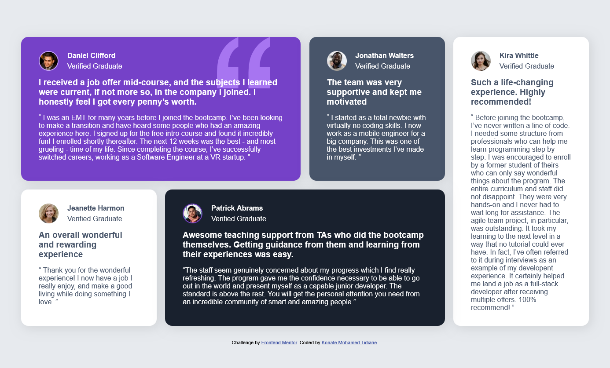

# Frontend Mentor - Testimonials grid section solution

## Table of contents

- [Overview](#overview)
  - [The challenge](#the-challenge)
  - [Screenshot](#screenshot)
  - [Links](#links)
- [My process](#my-process)
  - [Built with](#built-with)
  - [What I learned](#what-i-learned)
  - [Continued development](#continued-development)
  - [Useful resources](#useful-resources)
- [Author](#author)
- [Acknowledgments](#acknowledgments)

## Overview

### The challenge

Users should be able to:

- View the optimal layout for the site depending on their device's screen size

### Screenshot



### Links

- Solution URL: [https://github.com/Konamti/GridTestimonials.git]
- Live Site URL: [https://konamti.github.io/GridTestimonials/]

## My process

### Built with

- Semantic HTML5 markup
- CSS custom properties
- Flexbox
- CSS Grid
- Mobile-first workflow

### What I learned

I didn't know I could manipulate the postion of background image using the x and y axis.
It was interesting to learn this property.

```css
background-position-x: calc(100% - 70px);
```

### Continued development

I would like to learn more on the postion of items and images using the flexbox.

### Useful resources

## Author

- Frontend Mentor - [@Konamti](https://www.frontendmentor.io/profile/Konamti)

## Acknowledgments
